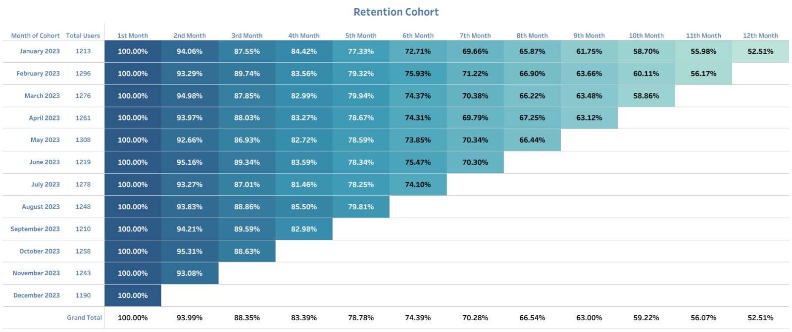
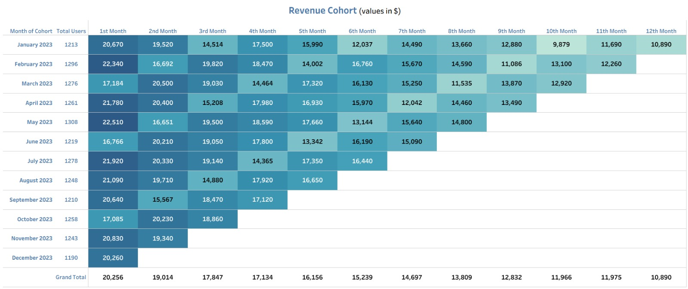
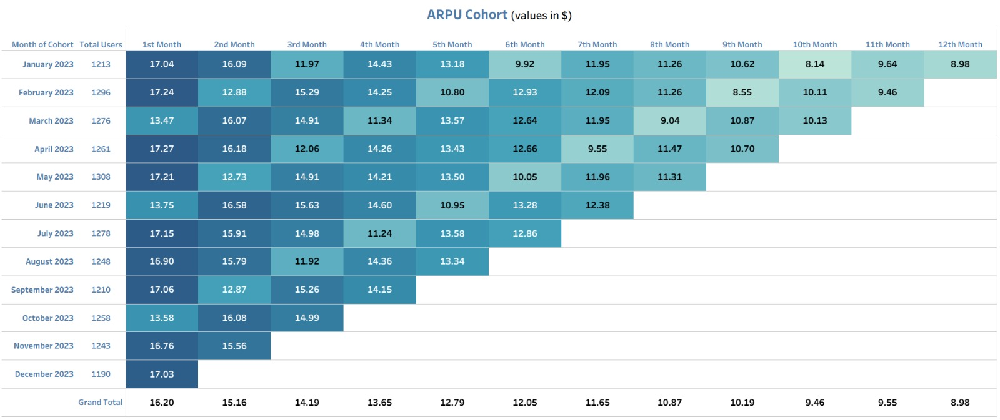
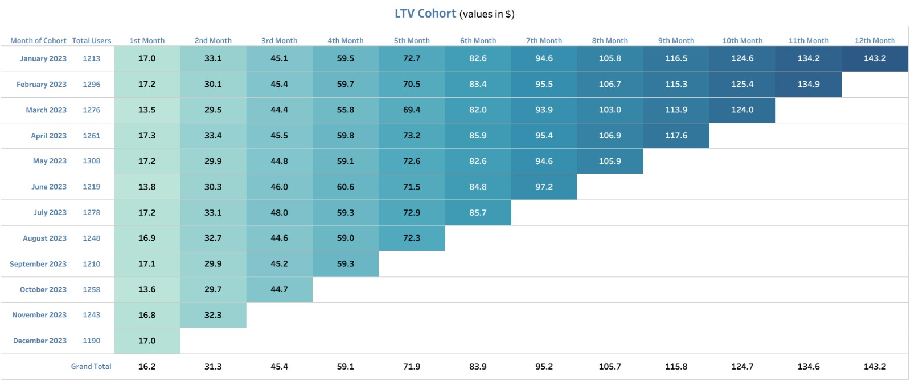

# 📊 Streamlytics Cohort Analysis

---

## 📌 Executive Summary

Streamlytics’ cohort analysis of user activity from **January 2023 to December 2023** shows strong user engagement, with **93–97% retention in Month 2** and **~50–60% retained beyond 10 months**, supporting a stable subscription model. While promo cohorts (**March, June, October**) generate lower initial revenue and ARPU, they quickly converge and deliver comparable long-term LTV, indicating effective acquisition without compromising user quality.

Retention remains consistent across **Basic, Standard, and Premium** plans, but LTV highlights clear value differences, with Premium users generating up to **~$247** compared to **~$175 for Standard** and **~$82 for Basic**. Focusing on Premium adoption, optimizing promotions, and driving plan upgrades can significantly improve long-term revenue and sustain growth.

---

## 📘 Project Background

Streamlytics is a recently founded subscription-based startup that provides users with access to curated digital learning content and tools through tiered plans (**Basic, Standard, Premium**). The platform focuses on delivering value through structured content, continuous access, and a simple subscription experience.

I am collaborating with the product and business teams to analyze user behavior and revenue performance to uncover insights that can support strategic decision-making and improve overall platform performance.

---

## 🎯 Goals

- Conduct cohort analysis for **retention** to understand user engagement and churn patterns  
- Conduct cohort analysis for **revenue** to track cohort-wise revenue trends  
- Analyze **ARPU (Average Revenue Per User)** to evaluate monetization efficiency across cohorts  
- Estimate **LTV (Lifetime Value)** to assess long-term user value  
- Compare performance across **Basic, Standard, and Premium plans** to identify differences in user behavior and value generation  

---

## 🔍 Insights Deep-Dive

### 📊 Retention Cohort

- User retention is **consistently strong across all cohorts**, with over **90% retained in Month 2**, indicating effective onboarding and immediate value delivery.  

- Retention declines **gradually and predictably over time**, reaching **~70% by Month 7** and stabilizing around **50–55% by Month 12**, reflecting a healthy churn pattern.  

- Cohorts from **March, June, and October (promo periods)** show slightly higher early retention (**~95% in Month 2**) compared to other cohorts, indicating stronger initial engagement.  

- Despite lower initial revenue in promo cohorts, their **retention remains comparable or slightly better**, suggesting that discounted acquisition does not compromise user quality.  

- Overall, retention patterns are **highly stable across cohorts**, indicating a reliable product experience and strong long-term user engagement.  

---

### 📊 Revenue Cohort

- Month 1 revenue shows **clear variation across cohorts**, with **March, June, and October** recording noticeably lower values, indicating differences in initial monetization.  

- The drop in these cohorts is driven by **pricing effects rather than user volume**, as these months correspond to periods where users entered at lower effective prices.  

- Despite lower initial revenue, these cohorts demonstrate **strong recovery in subsequent months**, with revenue levels aligning closely with non-promo cohorts by **Month 3–4**.  

- Revenue across all cohorts follows a **gradual declining trend over time**, primarily driven by user churn, with no abrupt fluctuations, indicating stable and predictable monetization behavior.  

- Overall, the revenue pattern suggests a **trade-off between lower initial revenue and sustained user contribution**, where reduced entry pricing does not negatively impact long-term revenue generation.  

---

### 📊 ARPU Cohort

- ARPU in Month 1 varies across cohorts, with most cohorts starting around **$17–17.3**, while **March, June, and October** start lower at **~$13.5–13.8**, reflecting reduced entry pricing.  

- Despite lower initial ARPU, these cohorts show a **strong recovery in early months**, with values increasing to approximately **$16–16.5 by Month 2**, aligning closely with other cohorts.  

- Across all cohorts, ARPU gradually declines over time, dropping from **~$17 in Month 1 to ~$10–12 by Month 7**, and further to **~$8–10 by Month 10–12**, driven by reduced user activity and churn.  

- The early convergence of ARPU across cohorts suggests that **initial pricing differences have limited long-term impact on per-user revenue contribution**, as user spending behavior stabilizes over time.  

- Overall, ARPU patterns remain **consistent across cohorts**, with most cohorts falling within a narrow range of **$10–13 during mid-lifecycle (Month 5–7)**, indicating predictable and stable monetization.  

---

### 📊 LTV Cohort

- LTV increases consistently across all cohorts, with the **January cohort growing from ~$17 in Month 1 to ~$143 by Month 12**, highlighting strong long-term value generation.  

- Cohorts from **March, June, and October** start with lower initial LTV (**~$13–14**) compared to other cohorts (**~$17**), reflecting reduced entry pricing.  

- Despite this gap, these cohorts **catch up significantly over time**, reaching approximately **$120–125 by Month 10–11**, closely aligning with non-promo cohorts.  

- By mid-lifecycle (**Month 6–7**), most cohorts converge within a narrow range of **$82–$86**, indicating that early pricing differences have limited long-term impact.  

- The steady increase in LTV without plateauing suggests that users continue to generate **incremental value even after 10+ months**, supported by stable retention levels (**~50–55%**).  

---

### 📊 Plan Wise Retention

- Retention is high across all three plans in Month 2, with **Premium (91.5%–96.5%)**, **Standard (91.0%–97.0%)**, and **Basic (93.1%–95.9%)**, showing strong initial engagement regardless of plan.  

- **March, June, and October** stand out as promo cohorts across all plans, consistently showing strong early retention.  

- **Standard and Premium do not show a consistent gap**, with performance varying across cohorts.  

- **Basic users often perform similarly or even outperform higher tiers**, indicating plan type is not the primary driver of retention.  

- Overall, **cohort timing matters more than plan type** for retention behavior.  

---

### 📊 Plan Wise LTV

- Premium users generate the highest LTV, reaching **~$247 by Month 12**, compared to **~$175 for Standard** and **~$82 for Basic**.  

- Standard users sit between Premium and Basic, with similar retention but lower pricing driving lower LTV.  

- Basic users have the lowest LTV due to pricing limitations despite stable retention.  

- The difference between Standard and Premium is significant (**~$72 gap by Month 12**), showing pricing drives value more than behavior.  

- Promo cohorts start lower across all plans but **converge over time**, maintaining strong long-term value.  

---

## 🚀 Recommendations

### Pricing & Plan Strategy

- Premium users generate significantly higher lifetime value (**~$247 vs ~$175 vs ~$82**), making them the most valuable segment. Focus on increasing Premium adoption through feature differentiation and perceived value.  

- Encourage upgrades from **Basic → Standard → Premium** through targeted nudges, feature unlocks, and in-app prompts.  

- Enhance Premium offerings to justify pricing and improve conversion.  

---

### Promotional Strategy

- Promo cohorts (**March, June, October**) show lower initial revenue but strong long-term value, indicating effective acquisition.  

- Optimize discount levels (**$30 → ~$24 impact**) to balance acquisition and revenue.  

- Use promotions to drive **plan upgrades**, not just new users.  

---

### Retention & Engagement

- Maintain strong onboarding (**~93–97% Month 2 retention**).  

- Improve mid-term retention (**Month 4–7**) with engagement strategies.  

- Replicate behaviors of long-term retained users (**~50–60% retention after 10+ months**).  

---

### Monetization & Growth

- Use **LTV as the primary decision metric** instead of short-term revenue.  

- Focus segmentation on **monetization rather than retention**.  

- Invest in **high-value cohorts** instead of only acquisition volume.  

---

### Product Strategy

- Improve feature differentiation across plans to increase willingness to pay.  

- Explore **annual plans, bundles, and loyalty pricing**.  

---

### Strategic Insight

- **Short-term revenue loss from promotions does not impact long-term value**, reinforcing an LTV-driven strategy.  
